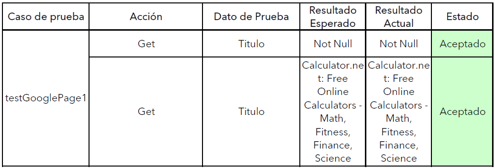

## **Laboratorio 5**
Complementando las pruebas elaboradas en la Practica 5 con `asserts`

Casos de prueba:

**Prueba 1:** En la primera prueba ingresamos a la página principal y con la ayuda de `assertNotNull()` primero verificamos que el título no este vacío, seguidamente con `assertTrue()` comprobamos que `verifyTitle` es verdadero.

Esta prueba es la misma realizada en la Practica 5, con la diferencia que para verifcar que la opción se realizó correctamente hacemos uso de `assertEquals()`.
Si el valor obtenido es igual al valor indicado, la prueba es aceptada.

Esta prueba es parecida a la mencionada anteriormente, solo que aquí para probar que las pruebas se esten verificando correctamente en la sentencia `assertEquals()` se proporciona un valor incorrecto. Por ende al realizar la prueba esta es rechazada.

