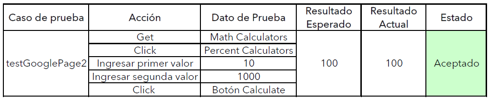
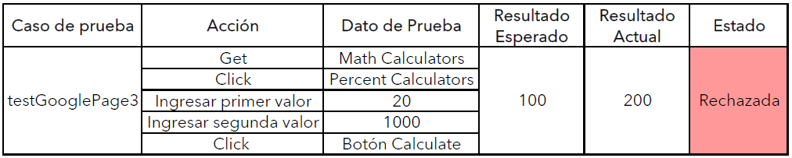

# **Ingeniería de Software II**
**Alumna:** Solange Aracely Romero Chacón
## **Practica 5**
Automatizando pruebas funcionales de aplicaciones web utilizando Selenium Web Driver. 

Siguiendo el tutorial: [Selenium Web Driver](https://www.tutorialspoint.com/selenium/selenium_webdriver.htm)

Pre-requisitos: 
*   Java 8+
*   [Eclipse IDE](https://www.eclipse.org/downloads/packages/release/mars/r/eclipse-ide-java-ee-developers) 
*   [Selenium Web Driver]( https://www.selenium.dev/)
*   [Browser-specific Web Driver](https://www.selenium.dev/documentation/en/webdriver/driver_requirements/)

Casos de Prueba en: http://www.calculator.net/

## **Laboratorio 5**
Complementando las pruebas elaboradas en la Practica 5 con `asserts`

Casos de prueba:

**Prueba 1:** En la primera prueba ingresamos a la página principal y con la ayuda de `assertNotNull()` primero verificamos que el título no este vacío, seguidamente con `assertTrue()` comprobamos que `verifyTitle` es verdadero.

Esta prueba es la misma realizada en la Practica 5, con la diferencia que para verifcar que la opción se realizó correctamente hacemos uso de `assertEquals()`.
Si el valor obtenido es igual al valor indicado, la prueba es aceptada.

Esta prueba es parecida a la mencionada anteriormente, solo que aquí para probar que las pruebas se esten verificando correctamente en la sentencia `assertEquals()` se proporciona un valor incorrecto. Por ende al realizar la prueba esta es rechazada.

